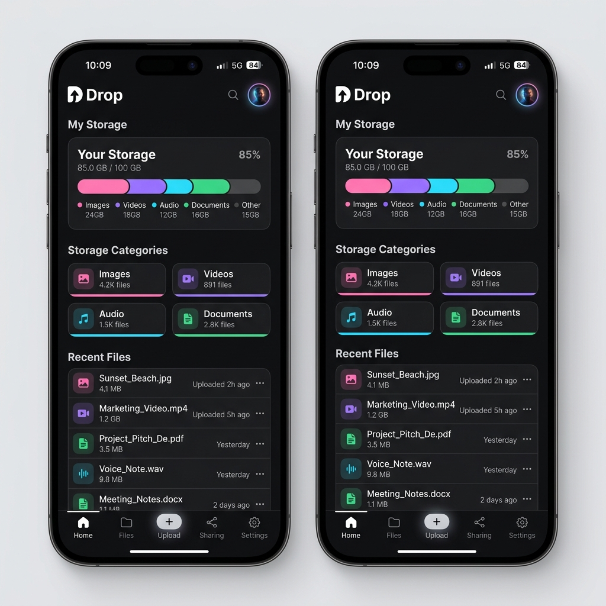

# Drop

[](https://github.com/eigger/drop/actions/workflows/ci.yml)
[](https://github.com/eigger/drop/actions/workflows/docker-release.yml)
[](https://nodejs.org/)
[](https://github.com/eigger/drop/blob/main/LICENSE)
[](proxmox/ct/drop.sh)
[](https://github.com/eigger/drop/pkgs/container/drop-api)

A lightweight, self-hosted file sharing service. Designed to make file transfers between mobile devices and PCs as simple as possible—upload directly from the share sheet in Android, and drag-and-drop on PC with single-click downloads.

[한국어 (Korean)](./README.ko.md)

---

### Screenshot


---

## Features

- **Uploads**: Drag & drop / file picker (multiple files), direct upload from other apps using Android's native share sheet (`share_target`).
- **Resumable Chunked Uploads**: Uploads in 8MB chunks—memory usage remains constant regardless of file size. If the upload gets interrupted (e.g. mobile background app termination), re-selecting the same file will resume from where it left off.
- **Downloads**: Individual downloads, or select multiple files using checkboxes to download them grouped in a single zip archive.
- **Folders**: Multi-level hierarchical folder structure, move files between folders.
- **Trash**: Deleted files are soft-deleted first and can be restored. Automatically deleted permanently after 30 days.
- **PWA**: Install to home screen, offline app shell caching.
- **Auth**: No public registration. The first user registration creates the admin account. Only the admin can add subsequent accounts. Two roles: admin and general user.
- **Localization**: English / Korean.
- **Lightweight Deployment**: PostgreSQL + Fastify API + Next.js Web + Caddy. Deploy using Docker Compose or via Proxmox LXC one-click script.

---

## Quick Start

### 1. Installation

**Proxmox (Recommended)**

```bash
bash -c "$(curl -fsSL https://raw.githubusercontent.com/eigger/drop/main/proxmox/ct/drop.sh)"
```

Sets up Docker on Debian 13 LXC, generates `.env` with random secrets at `/opt/drop`, and runs the stack using `drop.service` systemd unit. Once finished, connect via `http://<LXC_IP>`. Update later by running `update` inside the container.

**Docker Compose**

```sh
cp .env.example .env   # Configure POSTGRES_PASSWORD, JWT_SECRET
docker compose -f docker-compose.prod.yml up -d
```

Images are fetched from `ghcr.io/<owner>/drop-api` / `drop-web`. Make sure to set `GH_REPOSITORY_OWNER` correctly if you have forked the repository.

### 2. Creating the First Admin Account

Access `/login` right after installation. If no users exist, the **Create Admin Account** screen will be shown. Enter name, email, and password to sign up and login as admin. Public registration is disabled; subsequent users can only be added by the admin via **More → Users**.

### 3. Uploading via Share Sheet on Android

Once the PWA is installed on your home screen, Drop will appear on the Android native share sheet (e.g., from KakaoTalk, Gallery, etc.). iOS Safari does not support the Web Share Target API (recipient side) at the OS level, so iOS users need to open the web app directly and select files to upload.

---

## Project Structure

```
drop/
  apps/
    api/      # Fastify + Prisma (PostgreSQL)
    web/      # Next.js App Router (PWA, ko/en)
  packages/
    shared/   # Shared Zod schemas
  scripts/    # Icon generation scripts
  docker-compose.yml / docker-compose.prod.yml
  Caddyfile
  proxmox/    # Proxmox LXC installation
```

---

## Local Development

```sh
npm install
cp .env.example .env       # Configure POSTGRES_PASSWORD, JWT_SECRET
docker compose up -d postgres
npm run prisma:migrate
npm run dev:api             # :8080
npm run dev:web             # :3000
```

Open `http://localhost:3000` to create your initial admin account on first run.

Useful scripts: `npm run build`, `npm run test`, `npm run lint`, `npm run prisma:generate`.

---

## Production Notes

- Stack: PostgreSQL 16 + API + Web + Caddy (listening on `:80`; usually terminated with SSL via a reverse proxy or Cloudflare Tunnel).
- The API runs `prisma migrate deploy` automatically upon starting in the production compose stack.
- Images: `ghcr.io/<owner>/drop-api` / `drop-web` (`latest` + semver tags).
- LXC Updates: Run `update` inside the container to pull the latest compose images.
- Adjust the maximum upload limit via `FILE_SIZE_LIMIT_MB` (defaults to 10GB). Because of chunked uploads, increasing this limit does not affect server memory consumption.

---

## CI/CD

| Workflow | Trigger | Purpose |
|---|---|---|
| [`.github/workflows/ci.yml`](./.github/workflows/ci.yml) | Push to `main` / PR | Setup, lint, build, test |
| [`.github/workflows/docker-release.yml`](./.github/workflows/docker-release.yml) | GitHub Release | Push Docker images to GHCR |

---

## License

MIT. See [LICENSE](./LICENSE).
